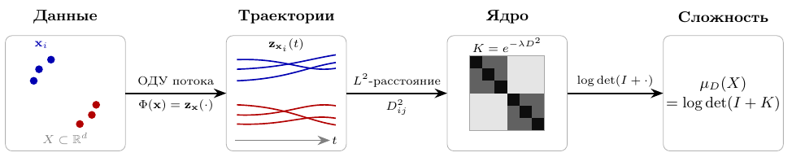

# Геометрический подход к оценке сложности данных на основе генеративных диффузионных моделей

Выпускная квалификационная работа бакалавриат, Физтех-школа прикладной
математики и информатики, МФТИ.

- **Автор:** Черноусов Данила Владиславович
- **Научный руководитель:** к.ф.-м.н. А. В. Грабовой

## Аннотация
Во многих задачах машинного обучения важно оценивать не только объём,
но и разнообразие обучающей выборки, причём без опоры на разметку: это
нужно для прогнозирования качества моделей, для отбора обучающих под-
выборок и для сравнения наборов данных одного объёма, но разного содер-
жания. Существующие меры сложности данных описывают лишь локальную
размерность или опираются на готовые признаковые представления и не улав-
ливают семантическую геометрию порождающего распределения, то есть то,
насколько объекты выборки близки по смыслу и на каких масштабах. В работе
предлагается извлекать эту геометрию из предобученной диффузионной мо-
дели: каждому объекту сопоставляется его траектория в порождающем про-
цессе, описывающая объект сразу на всех масштабах, а сложность выборки
оценивается как эффективный объём, который она занимает в пространстве
траекторий. Установлены достаточные условия корректности меры и дока-
заны теоремы о её свойствах, предложен способ её вычисления через тра-
ектории диффузионной модели, экспериментально показано семантическая
согласованность предложенной меры.

## Схема метода

